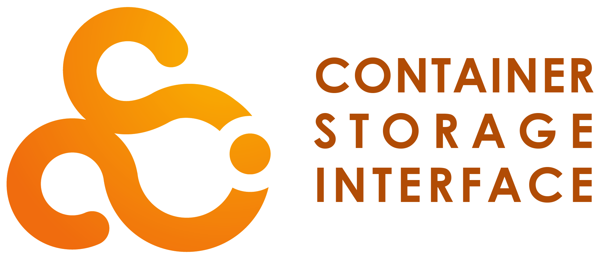

# OpenEBS Umbrella Project Vision

>
> [!Important]
> OpenEBS is an `Umbrella Project` whose governance and policies are defined in the [community](https://github.com/openebs/community/) repository.<br>
>This VISION file is applicable to every sub-project, repository and file existing within the [OpenEBS GitHub organization](https://github.com/openebs/).

OpenEBS (Open-Elastic-Block-Storage) aims to provide fast, resilient, available, enterprise-grade storage; natively inside a Kubernetes cluster as Hyper-Converged storage. OpenEBS Users provision OpenEBS storage services to Kubernetes applications running natively inside a Kubernetes cluster.

This document presents the project:

* Vision, Mission Statement and Scope
* Values
* Restraints
* Conformance
* Rules and Governance
* Why OpenEBS exists
* Goals and Objectives

## Vision, Mission Statement and Scope

**Our Vision:** The democratized Kubernetes enterprise storage standard <BR>
**Our Mission Statement:** OpenEBS is a *CNCF project* that provides fast, resilient, available, native, enterprise-grade storage to applications running in *Kubernetes clusters*.

| Term | Meaning     |
| :---       | :---                                    |
| *CNCF* | OpenEBS is an open source project operating within CNCF Storage Landscape guidelines and is focused on achieving ```Graduated Level``` status.   |
| *Fast* | Optimized multiple storage drivers and storage media types, with a particular focus on Solid State Flash media.  |
| *Resilient* | Storage is highly resilient and self-healing. Reads and writes are protected even as containers or nodes are terminated. Volumes and Data Writes can be replicated across nodes via replication. Snapshots and cloning provide additional levels of tolerance, resilience & self-healing. |
| *Available* | Storage attached to one node can be made addressable to applications running on any node within the cluster through a ```“Nexus” Virtual SAN Fabric``` (i.e. Block mode Storage Area Network). |
| *Native* | Implemented as ```container native storage```, a Kubernetes natively integrated component, optimized for storage contained inside a Kubernetes cluster (Hyper-converged). |
| *Enterprise grade* | A fully featured, community-proven, rigorously tested, trustworthy, Mission Critical product. |
| *Kubernetes* | OpenEBS focus is for Kubernetes-on-Linux. |
| *Democratized* | Accessible to everyone. |

<BR>

> [!IMPORTANT]
> With OpenEBS, users can attach any storage media (block-mode storage device) to a node, and assign it to be managed by OpenEBS; where the system can be configured to provide access to provisioned Storage volumes across any container within the cluster. You can address block devices across nodes and create volume snapshots/clones. You can set up Highly flexible local volumes and expand the volume and filesystem while online. You can trust OpenEBS whether you are a hobbyist programmer, a small business, or a large enterprise.
<BR>

### Scope

The OpenEBS project has a clearly defined focus for our community. We are explicitly naming the following capabilities as `in-scope` and `out-of-scope` for the project:

> **In Scope** <BR>

| Item  | Scope and description     |
| :---: | :---                      |
| 1. | OpenEBS Standard product, with installation via Helm charts for Kubernetes |
| 2. | ```Block mode``` storage management and integration |
| 3. | ```Local``` and ```Fabric Addressable``` block-mode storage services |
| 4. | ```Non-replicated``` (Single Node resident vol) and ```Replicated``` (Multi-Node Distributed vol) block-level storage |
| 5. | ```Filesystem``` integrations (Kernel, FUSE) |
| 7. | Cluster-wide Block mode storage address space ```vSAN Fabric``` |
| 8. | Block, file, ```application``` storage services |
| 9. | ```Rest API```, ```CLI``` and Extensibility for using, embedding, and extending OpenEBS capabilities |
| 10. | Storage Reporting, alerting, monitoring, metrics |
| 11. | Read/Write Access Modes for RWO, ROX, RWOP - (*RWX with strict limitations) |
| 12. | Deployable as ```On-premise```,```SaaS/PaaS in-cloud```, ```Bare Metal```, ```Hypervisor``` infrastructure |

<BR>

> **Out-of-Scope**

| Item  | Scope and description     |
| :---: | :---                      |
| 1. | Updates to legacy/deprecated storage drivers (archived in the OpenEBS-archive organization) |
| 2. | Graphical user interface for setup, administration, reporting, dashboards |
| 3. | Vendor-specific proprietary integrations, including vendor-specific cloud hosting integrations and optimizations |
| 4. | Vendor-specific authentication, authorization, key management |
| 5. | Application-level optimizations and Storage operations beyond what is provided in the file system and kernel drivers (the OpenEBS project does not improve upon or develop our own file systems, nor do we add optimization capabilities) |
| 6. | Complex Business Application Logic optimizations that can't be easily supported or publicly discussed via/in a free open-source Slack support channel without compromising the user/businesses |
| 7. | K8s cluster-specific, Non-storage related business logic. (logic that applies ``` primarily ``` to the K8s cluster space and not the storage space) |

<BR>

**ALL** Issues, Pull Requests, feature requests (OEPs), contributions, and roadmap requests will be evaluated against these scopes, and the OpenEBS mission statement.

---

## Values

The OpenEBS project and its leadership embrace the [values of CNCF](https://github.com/kubernetes/community/blob/master/values.md).

## Restraints

OpenEBS is a self-governing project, and operates within the following restraints:

### CNCF

* OpenEBS is a [CNCF (Cloud Native Computing Foundation)](https://cncf.io) project.
* The OpenEBS project is open source, and operations are governed by CNCF rules set up for CNCF projects.
* The OpenEBS project adds ```domain-specific Governance```, ```Contribution``` and ```operating rules``` on **top of the CNCF rules**. We provide for exceptions from the CNCF rules if approved by the CNCF Technical Oversight Committee (TOC).

 [](https://github.com/kubernetes/community/tree/master/sig-storage)  [](https://github.com/cncf/tag-storage)  &emsp; &emsp; [](https://github.com/cncf/communitygroups)

## Conformance

The OpenEBS project produces the OpenEBS product referred to as **```Open Source STANDARD```** (OSS).<BR>
Many commercial and non-commercial vendors have incorporated, or wish to incorporate a version of OpenEBS as a component or integrated service within their own product offering, including Microsoft Azure, DataCore, and Civo. [see ADOPTERS file](./ADOPTERS.md)

The OpenEBS project and CNCF recognize the importance of supporting this and maintaining a conformance program for vendors to use OpenEBS technology and OpenEBS marks.

## Rules and Governance

The [OpenEBS GitHub organization](https://github.com/openebs) has multiple repositories, for the purpose of organizing project information, source code, assets, Intellectual property (IP), and resources. Every repository in the organization follows the same set of “umbrella” Project Rules and [Governance](./GOVERNANCE.md). All community-wide information is located in the [OpenEBS Community Repository](https://github.com/openebs/community).

## Why OpenEBS exists

Traditional storage solutions were not built with Kubernetes in mind, leading to challenges such as:

- **Complex Storage Provisioning**: Traditional storage requires extensive configuration and manual provisioning.
- **Lack of Portability**: Many storage solutions are tightly coupled with specific cloud providers or on-premises infrastructures, limiting flexibility.
- **Scalability Issues**: Traditional storage architectures struggle to scale efficiently in dynamic Kubernetes environments.
- **Multi-Tenancy & Isolation**: Kubernetes applications require storage solutions that can isolate workloads and provide multi-tenant support efficiently.

OpenEBS addresses these issues by offering a Kubernetes-native approach to storage, containerizing the storage controllers and leveraging the Kubernetes API for management.
- OpenEBS enables users to leverage their existing tech stacks based on familiar technologies like ZFS and LVM to migrate to Kubernetes, thus reducing the learning curve and streamlining the transition to K8s.
- OpenEBS provides a very simple and light-weight hostpath local PV option for easy onboarding of users and their applications to K8s.
- For applications which need storage fault tolerance, OpenEBS includes replication features to ensure data redundancy and higher availability.

Overall, OpenEBS enhances Kubernetes by providing a flexible storage solution that can meet a wide range of requirements and help users make the most out of their containerized environments.

### Key Features of OpenEBS
- **Dynamic Storage Provisioning**: Users can dynamically provision Persistent Volumes (PVs) with minimal configuration.
- **Multiple Storage Engines**: OpenEBS offers various storage engines such as Local PV options (Hostpath, ZFS, LVM and Rawfile) and Replicated PV Mayastor, catering to different performance and resiliency requirements.
- **Resiliency and Replication**: Provides synchronous and asynchronous replication for high availability.
- **Cloud-Native Architecture**: Fully integrates with Kubernetes, leveraging its declarative nature and APIs for seamless storage operations.
- **Observability and Monitoring**: Includes built-in monitoring with Prometheus and Grafana integrations.

OpenEBS can be used in several cloud-native scenarios:

#### 1. Kubernetes Stateful Applications
 - Supports applications such as MySQL, PostgreSQL, MongoDB, and Cassandra that require persistent storage.
 - Ensures high availability and resilience through replication mechanisms.

#### 2. Hybrid and Multi-Cloud Storage
 - Enables organizations to run stateful workloads across different cloud providers.
 - Provides seamless storage portability, making migrations easier.

#### 3. Edge Computing and IoT
 - Can be deployed in edge environments where lightweight, distributed storage solutions are needed.
 - Works well with Kubernetes distributions optimized for edge computing (e.g., K3s, MicroK8s).

#### 4. CI/CD Pipelines and Dev/Test Environments
 - Provides fast and ephemeral storage for continuous integration and testing workflows.
 - Supports quick provisioning and teardown of test environments without affecting production systems.

#### 5. Disaster Recovery and Backup Solutions
 - OpenEBS replication capabilities help create disaster recovery strategies for Kubernetes applications.
 - Works with backup tools like Velero to create snapshots and restore data when needed.

OpenEBS is a versatile cloud-native storage solution designed for Kubernetes workloads. By offering dynamic provisioning, multi-tenancy, and scalability, it bridges the gap between traditional storage and the growing needs of continuously evolving Kubernetes-based applications. OpenEBS is a compelling choice for enterprises looking to build resilient, portable, and high-performance storage solutions in diverse cloud-native environments.

## Goals and Objectives

OpenEBS is an open-source Cloud Native storage solution that provides cloud-native storage for Kubernetes stateful workloads following vendor-neutral principles.

Listed below are the goals and objectives:
### 1. Cloud Native Storage for Kubernetes
 - Ensure seamless integration with Kubernetes environments.
 - Provide container-attached storage that aligns with Kubernetes-native architectures.
 - Deliver dynamically provisioned storage with persistent volumes (PVs) managed via Kubernetes StorageClasses.

### 2. Open Source and Community-Driven
 - Foster an open and active community contributing to continuous innovation.
 - Ensure transparency, extensibility, and flexibility through an open governance model.
 - Collaborate with other Cloud Native Computing Foundation (CNCF) projects and Kubernetes ecosystem tools.

### 3. Simplified Storage Management
 - Enable DevOps teams to provision, manage, and scale storage without requiring deep storage expertise.
 - Offer policy-driven automation for storage provisioning, data protection, and lifecycle management.
 - Ensure easy deployment with no complex external dependencies.

### 4. Scalability and Performance Optimization
 - Support a scale-out architecture, allowing storage resources to grow with application demand.
 - Provide flexible data replication and storage engine choices (Local and Replicated PV) to match performance needs.
 - Optimize storage for cloud, hybrid, and on-premises Kubernetes deployments.

### 5. Data Resilience and High Availability
 - Offer built-in replication, snapshots, and backup capabilities.
 - Ensure data integrity and protection across the cluster nodes.
 - Support disaster recovery.

### 6. Developer and DevOps Friendly
 - Provide a declarative, Kubernetes-native approach to storage management.
 - Support GitOps, CI/CD pipelines, and automated workflows for persistent storage.
 - Enable easy monitoring and troubleshooting with Kubernetes observability tools.

### 7. Storage Agnostic and Portable
 - Work across cloud providers, on-premises, and hybrid environments without vendor lock-in.
 - Support multiple storage backends, including local disks, networked storage, and cloud block storage.
 - Integrate with cloud native backup tools to seamlessly migrate application data between different storage types and clusters.

### Differentiation in the Cloud Native Landscape
Unlike traditional storage solutions, OpenEBS takes a Kubernetes-first approach, allowing:
  -  **Flexible Storage Choice:** Provide flexible data replication and storage engine choices (Local and Replicated PV) to match performance needs.
  -  **Containerized Storage Architecture:** Runs as Kubernetes pods, making it portable and easy to deploy across different environments.
  - **Granular Storage Customization:** Developers can configure features like replication, thin-provisioning, compression, encryption on a per-application basis with the right storage engine selection.
  - **No Vendor Lock-In:** Fully open-source, OpenEBS provides an alternative to proprietary Cloud Native storage solutions.

OpenEBS addresses the needs of Kubernetes storage by delivering a truly Cloud Native, flexible, and scalable storage solution. It empowers DevOps teams, application developers and cloud SREs in small, medium and large enterprises and CSPs to manage modern stateful workloads efficiently while integrating seamlessly into the Cloud Native ecosystem. Through its community-driven development, OpenEBS continues to evolve, solving persistent storage challenges in Kubernetes environments.

## Archive Organization
>
> [!IMPORTANT]
> The OpenEBS project Leadership/Maintainers also administer the affiliated [**OpenEBS-archive organization**](https://github.com/openebs-archive). <BR>
>
> 1. This parallel organization is **OWNED by CNCF** and administrated as a reference archive for OpenEBS ```Legacy``` and ```Deprecated``` OpenEBS repositories, assets, IP, source code, dependencies and resources. <BR>
> 2. From time to time, we reserve the right to selectively Deprecate and Archive OpenEBS components and  physically migrate them **```out-of```** the OpenEBS Parent project; and into the Archive organization. This process **```officially removes```** those OpenEBS components from the parent OpenEBS project/product. All entities held within the Archive org are **NO LONGER** an active component of the OpenEBS Parent project/product. <BR>
> 3. The Archive org is **NOT** intended for active code or community contributions. The [Project Rules and Governance](./GOVERNANCE.md) also apply to the OpenEBS-archive organization, unless explicitly stated otherwise in the OpenEBS-archive organization README. <BR>

## Code of Conduct

OpenEBS follows the [CNCF Code of Conduct](https://github.com/cncf/foundation/blob/main/code-of-conduct.md).
